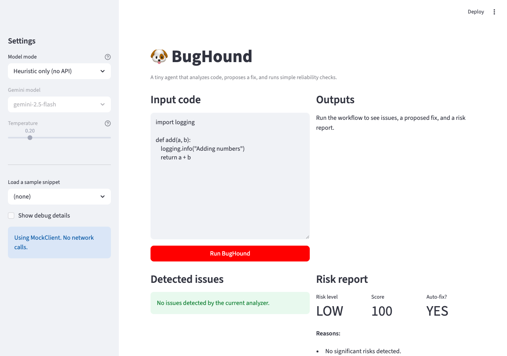
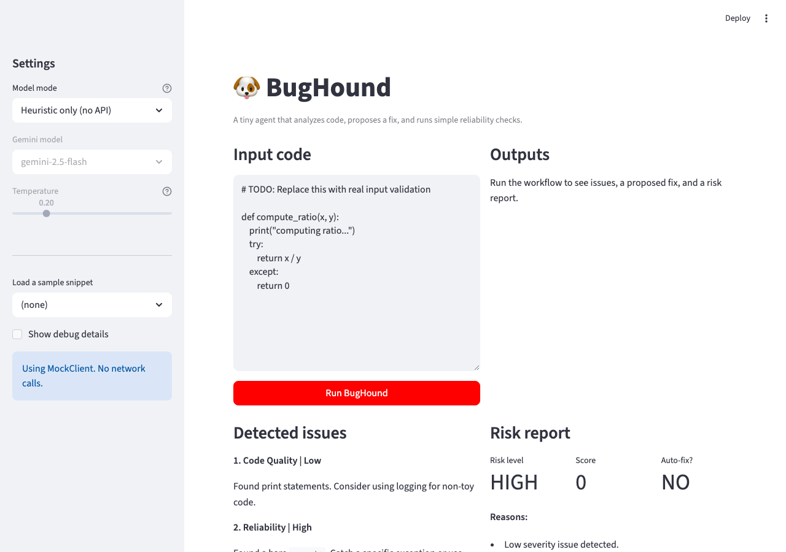
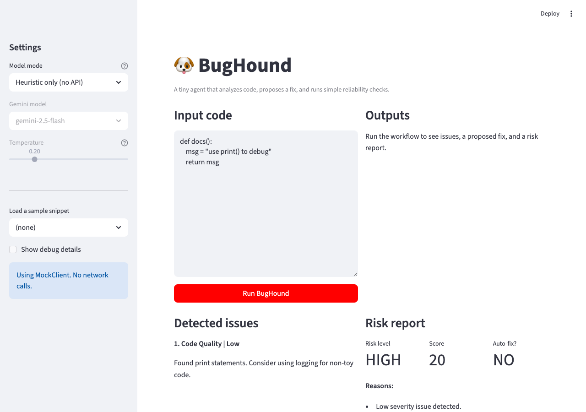
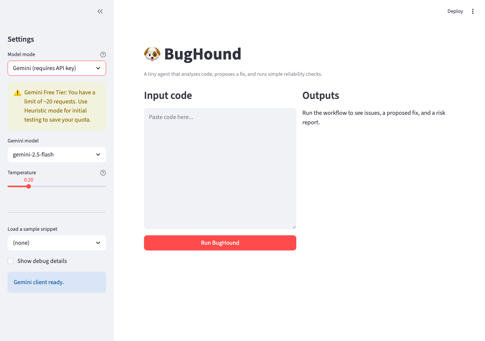
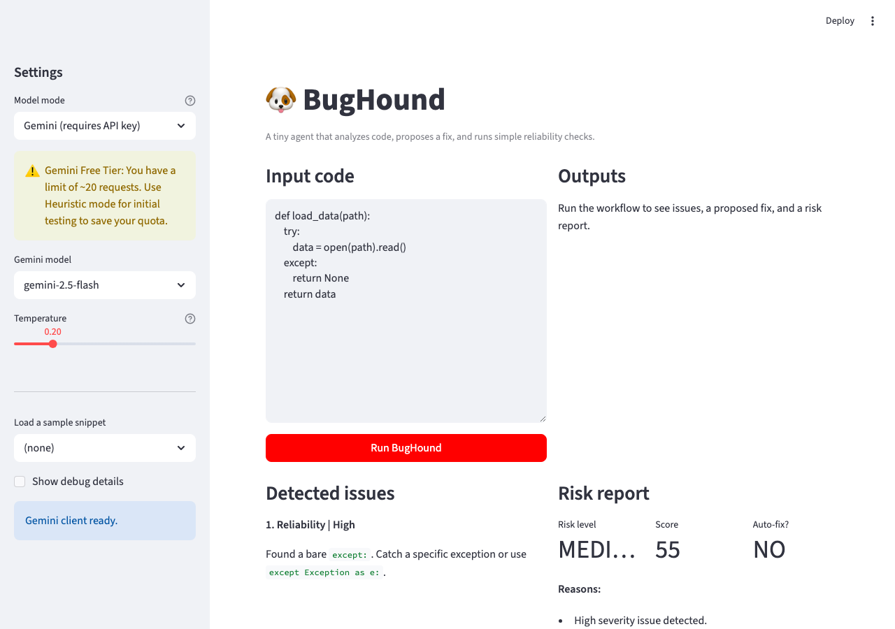

# 🐶 BugHound

BugHound is a small, agent-style debugging tool. It analyzes a Python code snippet, proposes a fix, and runs basic reliability checks before deciding whether the fix is safe to apply automatically.

---

## What BugHound Does

Given a short Python snippet, BugHound:

1. **Analyzes** the code for potential issues  
   - Uses heuristics in offline mode  
   - Uses Gemini when API access is enabled  

2. **Proposes a fix**  
   - Either heuristic-based or LLM-generated  
   - Attempts minimal, behavior-preserving changes  

3. **Assesses risk**  
   - Scores the fix  
   - Flags high-risk changes  
   - Decides whether the fix should be auto-applied or reviewed by a human  

4. **Shows its work**  
   - Displays detected issues  
   - Shows a diff between original and fixed code  
   - Logs each agent step

---

## Setup

### 1. Create a virtual environment (recommended)

```bash
python -m venv .venv
source .venv/bin/activate   # macOS/Linux
# or
.venv\Scripts\activate      # Windows
```

### 2. Install dependencies

```bash
pip install -r requirements.txt
```

---

## Running in Offline (Heuristic) Mode

No API key required.

```bash
streamlit run bughound_app.py
```

In the sidebar, select:

* **Model mode:** Heuristic only (no API)

This mode uses simple pattern-based rules and is useful for testing the workflow without network access.

---

## Running with Gemini

### 1. Set up your API key

Copy the example file:

```bash
cp .env.example .env
```

Edit `.env` and add your Gemini API key:

```text
GEMINI_API_KEY=your_real_key_here
```

### 2. Run the app

```bash
streamlit run bughound_app.py
```

In the sidebar, select:

* **Model mode:** Gemini (requires API key)
* Choose a Gemini model and temperature

BugHound will now use Gemini for analysis and fix generation, while still applying local reliability checks.

---

## Running Tests

Tests focus on **reliability logic** and **agent behavior**, not the UI.

```bash
PYTHONPATH=. pytest tests/ -v
```

> Note: `PYTHONPATH=.` is required so pytest can resolve `bughound_agent` and `reliability` as top-level modules.

The 9 tests cover:

* Risk scoring and guardrails (`test_risk_assessor.py`)
* Heuristic fallbacks when LLM output is invalid (`test_agent_workflow.py`)
* End-to-end agent workflow shape and output types
* String literal mutation detection — prevents false-positive heuristics from auto-applying over-edits
* Medium/High severity issue gate — blocks auto-fix even when the risk score is technically low

---

## Reliability Guardrails

Three guardrails were added beyond the starter implementation:

| Guardrail | Location | What it prevents |
|-----------|----------|-----------------|
| Severity normalization | `bughound_agent._normalize_issues` | Non-standard severity values (e.g. `"Critical"`, `"MEDIUM"`) silently bypassing risk scoring |
| Medium/High severity gate | `risk_assessor.assess_risk` | Auto-fix triggering on notable issues even when the score is ≥ 75 |
| String literal mutation | `risk_assessor.assess_risk` | Heuristic false positives rewriting text inside string literals and auto-applying the change |

---

## Demo

### Test 1 — Clean Code (No Issues)


### Test 2 — Bare Except (High Severity)


### Test 3 — All Three Heuristic Patterns


### Test 4 — Medium Severity Blocks Auto-Fix (Part 3 Guardrail)


### Test 5 — String Literal Mutation Blocked (Part 4 Guardrail)


### Test 6 — Edge Case: Comments Only


### Test 7 — Gemini Mode Sidebar Warning


### Test 8 — Gemini Mode in Action (flaky_try_except.py)


---

## Tech Fellow Notes

The core concept students needed to understand is that agentic systems are not just single AI calls — they are pipelines where each step (analyze, act, assess, reflect) has its own failure modes, and reliability comes from the rules around the AI, not from the AI itself. Students most commonly struggled with the risk assessor's scoring logic: it was easy to read the numbers without questioning whether the thresholds and penalties actually matched real-world risk, and many initially accepted the default `should_autofix = level == "low"` without considering that a "low risk score" and "safe to auto-apply" are not the same thing. AI tools like Copilot were genuinely helpful for understanding unfamiliar code quickly and drafting test structures, but they were misleading when used to evaluate whether a guardrail was *necessary* — Copilot tends to validate whatever framing is given to it rather than push back on the design decision. To guide a student who is stuck on the guardrail section without giving the answer, a good prompt is: "Look at the `print(` detection in `_heuristic_analyze` — what Python construct could contain those exact characters without being a function call, and what would the fixer do to it?" — this leads them to find the string literal false positive themselves rather than being told where to look.
